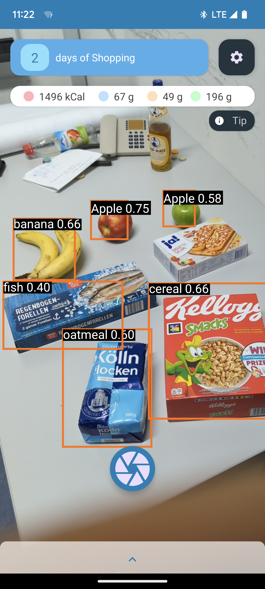
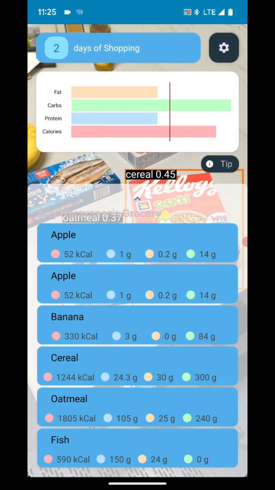

# Real-time on-device grocery object detection and nutrition calculation App

TUM AI Makeathon Fall 2022 \
48 hours challenge

Website: https://devpost.com/software/own_challenge_snax

Android App is written in Kotlin: https://github.com/AjayDextrous/SnaxApp

### Techstack
- Azure AutoML - Label a few images manually, and use AutoML to train a network to automatically label our customized dataset
- Tensorflow Lite model - Deploy EfficientDet-lite0 on Android App to enable real-time object detection

